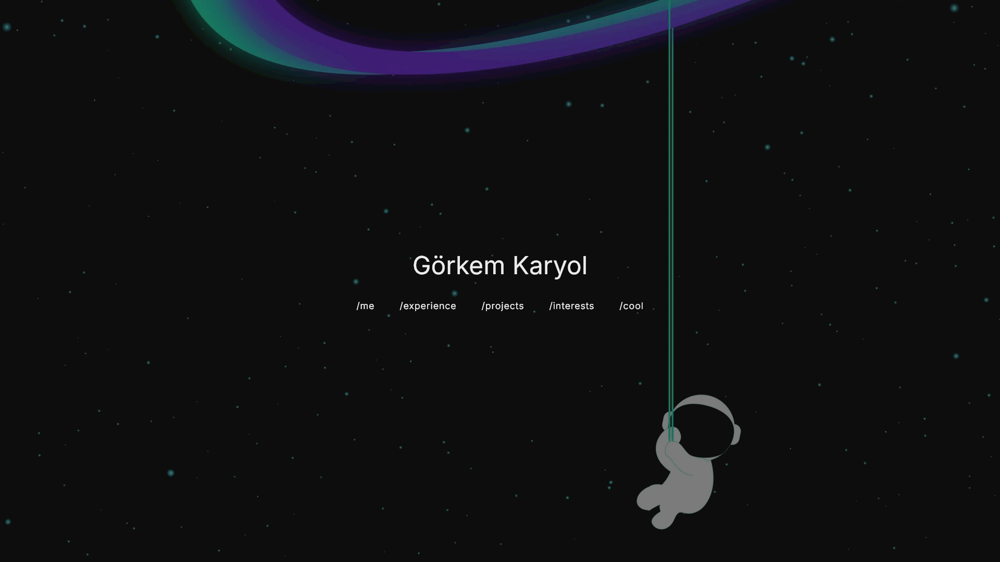

# [gorkemkaryol.dev](https://www.gorkemkaryol.dev/)

Welcome to the public repository of my personal website. This project includes various components and functionalities for my portfolio, including API integrations and dynamic project displays.  

> **Note:** All API calls are handled by a private backend repository. You can view a **mimic public version** of the backend to understand the structure: [Mimic Backend Repository](https://github.com/Glory42/Portfolio_Backend_Mimic).

## Overview

This portfolio has 5 main routes:

- `/` — Home page (**Me**) showcasing personal information.  
- `/projects` — Side projects showcase.  
- `/experience` — Volunteering and work experiences.  
- `/interests` — Personal interests.  
- `/cool` — COOL.

## Tech Stack

- [Astro](https://astro.build)  
- [TypeScript](https://www.typescriptlang.org)  
- [Tailwind CSS](https://tailwindcss.com)  
- [Vite](https://vitejs.dev)  

## API Integrations

The site fetches dynamic content via backend API calls. Currently supported APIs:

- **GitHub** — For fetching projects or contributions.  
- **Literal** — For fetching book reading stats/activities.  
- **Spotify** — Currently playing track or favorite music.

Since the backend is private, see the **mimic backend repo** above for reference on request structure and endpoints.

## Getting Started

### Prerequisites

- Node.js (version 18.x or later)  
- npm or yarn  

### Running Locally

```bash
$ git clone https://github.com/Glory42/ma-portfolio.git
$ cd ma-portfolio
$ npm install
$ npm run dev
```

Navigate to `http://localhost:4321` to see the development server in action.

### Environment Variables

Create a `.env` or `.env.local` file in the root of your project and add variables if you use any APIs or secrets (e.g., Github, Spotify, Literal, etc.):

```bash
# Example:
GITHUB_TOKEN=your_github_token
SPOTIFY_CLIENT_ID=your_spotify_client_id
SPOTIFY_CLIENT_SECRET=your_spotify_secret
SPOTIFY_REFRESH_TOKEN=your_spotify_refresh_token
```

## How It Works

- **Frontend:** Built using Astro + TypeScript, styled with Tailwind CSS for a fast and responsive experience.  
- **Components:** Modular, reusable UI components for sections like Me, Projects, Interests, Experience, CoolRoute, etc.  
- **Backend:** All API calls are routed through a backend server. For public understanding, see the mimic repo.  
- **Deployment:** Can be hosted on Vercel, Netlify, or GitHub Pages.  

## Learning Resources

**TypeScript**  
- [Codecademy: Learn TypeScript](https://www.codecademy.com/enrolled/courses/learn-typescript)  
- [YouTube Tutorial](https://youtu.be/SpwzRDUQ1GI?si=ZKZuJcXQy_fJBl-n)  

**Astro**  
- [Astro Docs](https://docs.astro.build/en/getting-started/)  
- [YouTube Tutorial](https://www.youtube.com/watch?v=e-hTm5VmofI&t=552s)  

**Tailwind / CSS**  
- [Tailwind Docs](https://tailwindcss.com/docs/installation/using-vite)  
- [W3Schools CSS](https://www.w3schools.com/Css/)  

## License

This project is licensed under the **GNU General Public License v3.0** – see the [LICENSE](LICENSE) file for details.

## Contact

If you have any questions, feel free to reach out to me at `gorkemkaryol03@gmail.com`.