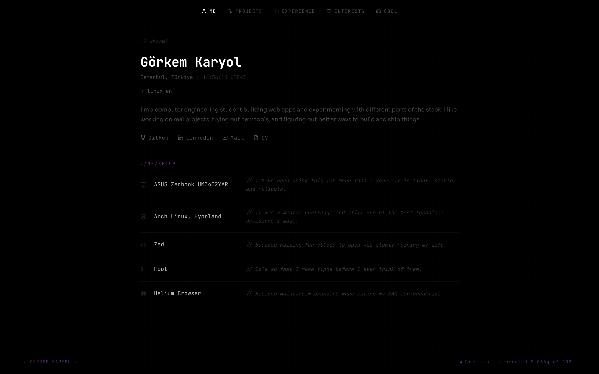

# [gorkemkaryol.dev](https://gorkemkaryol.dev)

Personal portfolio built with TanStack Start, deployed on Cloudflare Workers.



## Stack

- TanStack Start (React + TanStack Router + server functions)
- Bun
- Cloudflare Workers
- TypeScript
- Tailwind CSS

## Integrations

- **GitHub GraphQL API** — pinned projects and contribution data
- **Literal GraphQL API** — favorite books shelf and currently reading shelf
- **Interis** (`interis.gorkemkaryol.dev`) — my self-hosted movie tracker; the interests page pulls my top 4 films and top 4 series via the public API

## Environment

Create a `.dev.vars` file (for local dev) or set Worker bindings (for production):

```bash
GITHUB_TOKEN=...
PUBLIC_GITHUB_USERNAME=...
LITERAL_EMAIL=...
LITERAL_PASSWORD=...
INTERIS_USERNAME=...   # your Interis username, used to fetch top films/series
```

`INTERIS_USERNAME` and `PUBLIC_GITHUB_USERNAME` are non-secret public variables — they are declared under `vars` in `wrangler.jsonc` so they are available in preview deployments without a secret binding. `keep_vars: true` is set so that dashboard variables (secrets) are not wiped on each deploy.

All API secrets are server-only and read from Workers runtime bindings at request time.

## Development

```bash
bun install
bun dev
```

## Build

```bash
bun run build
```

Creates `.output/` (Worker deploy artifact expected by `wrangler.jsonc`).

## Deploy

```bash
npx wrangler deploy
```

`wrangler.jsonc` uses `nodejs_compat` because TanStack Start's server runtime imports Node-compatible modules internally.
