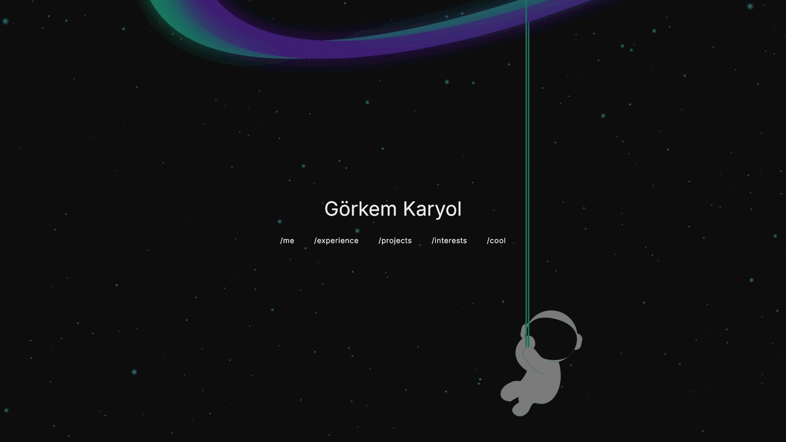

# gorkemkaryol.dev

Personal portfolio built with Astro and deployed to Cloudflare Pages.

## Stack

- Astro (static-first with function-backed SSR routes)
- TypeScript
- Tailwind CSS + tokenized custom CSS system
- React islands (only for `LiveClock` and `CoolButtonGame`)
- GitHub GraphQL API (featured projects + README + contributions)
- Literal GraphQL API (currently reading shelf)

## Routes

- `/` - profile, contact links, tech stack cards
- `/projects` - contribution board + featured GitHub repos
- `/projects/[slug]` - repository README rendered from GitHub markdown
- `/experience` - experience timeline
- `/interests` - favorites + server-rendered currently reading books
- `/cool` - interactive easter egg page
- `/api/books` - JSON endpoint backed by Literal data utility

## Environment Variables

Copy `.env.example` to `.env`:

```bash
PUBLIC_GITHUB_USERNAME=your_username
GITHUB_TOKEN=your_github_token
LITERAL_EMAIL=your_email@example.com
LITERAL_PASSWORD=your_literal_password
```

## Development

```bash
npm install
npm run dev
```

## Build and Validation

```bash
npm run lint
npm run check
npm run build
```

## Notes

- Dynamic routes (`/projects`, `/projects/[slug]`, `/interests`, `/api/books`) are server-rendered via Cloudflare adapter.
- README markdown is rendered server-side with GFM support, syntax highlighting, relative URL rewriting, and sanitization.
- Secrets stay server-side; only `PUBLIC_GITHUB_USERNAME` is exposed to client-facing code.
