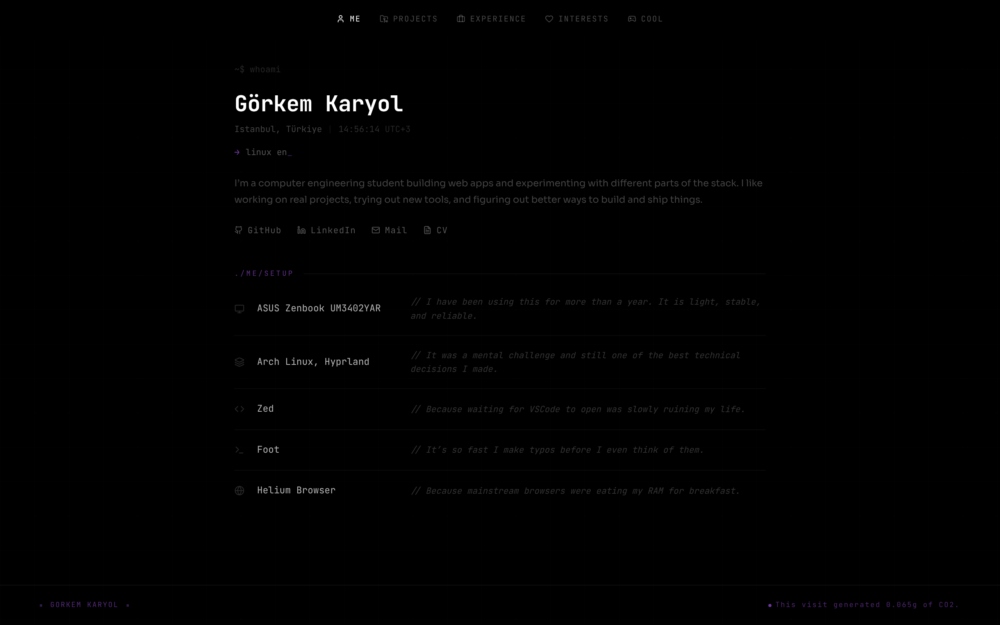

# [gorkemkaryol.dev](https://gorkemkaryol.dev)

[](https://gorkemkaryol.dev)
[](https://tanstack.com/start)
[](https://workers.cloudflare.com)
[](https://www.typescriptlang.org)
[](https://bun.sh)
[](./LICENSE)

This is the source for my personal site. It's where I keep my projects, a running log of what I'm reading and watching, and a playground of small web toys I build when I want to try something. It's a TanStack Start app running on Cloudflare Workers, and every external bit of data on it is pulled live at request time rather than from a hand-maintained list.



## Pages

- **Home** - a short intro and a snapshot of what I'm up to lately
- **Projects** - two columns: *featured* is my own repos (anything I've tagged with the `featured` topic on GitHub), *contributed* is a few manual entries plus my GitHub contribution activity. Opening a project renders its live GitHub README, server-side.
- **Experience** - a work and community timeline
- **Interests** - what I'm reading and have finished (from [Literal](https://literal.club)), and the films and series I'm watching or have watched (from Interis, below)
- **Playground** - Snake, Flappy Bird and Tetris in the browser; a NASA page (astronomy picture of the day + near-Earth asteroids); `whoami`, which shows what the Cloudflare edge sees about your connection; and `sysinfo`

## Stack

- TanStack Start (React 19 + TanStack Router + server functions)
- Bun
- Cloudflare Workers, via `@cloudflare/vite-plugin`
- TypeScript
- Tailwind CSS
- Vitest for tests, `marked` for README rendering

## Integrations

Everything here is read-only, fetched on the server, and cached at the edge, so the site stays fast and I never have to copy-paste an "updated" list into a file.

- **GitHub GraphQL API** - featured projects and contribution data
- **Literal GraphQL API** - my favorites shelf and currently-reading shelf
- **Interis** (`interis.gorkemkaryol.dev`) - my self-hosted movie tracker; the interests page pulls my top 4 films and top 4 series from its public API
- **NASA APIs** - APOD (picture of the day, image or video) and NeoWs (near-Earth objects)

## Environment

Copy `.env.example` to `.env` for local dev; set the same keys as Worker bindings for production.

```bash
GITHUB_TOKEN=...
PUBLIC_GITHUB_USERNAME=...
LITERAL_EMAIL=...
LITERAL_PASSWORD=...
INTERIS_USERNAME=...     # Interis username, used to fetch top films/series
NASA_API_KEY=...         # optional, falls back to NASA's DEMO_KEY when unset
```

`INTERIS_USERNAME` and `PUBLIC_GITHUB_USERNAME` are non-secret and live under `vars` in `wrangler.jsonc`, so preview deployments get them without a secret binding. `keep_vars: true` keeps the dashboard secrets from being wiped on each deploy.

Every API secret is server-only and read from the Workers runtime bindings at request time; see `src/lib/env.ts`.

## Development

```bash
bun install
bun dev            # vite dev on http://localhost:3000
```

## Test

```bash
bun test           # vitest run
```

## Build

```bash
bun run build
```

Runs `vite build`, `tsc --noEmit`, then assembles `.output/`, the Worker deploy artifact `wrangler.jsonc` points at.

## Deploy

```bash
bun run deploy     # build + wrangler deploy
```

`wrangler.jsonc` sets `nodejs_compat` because TanStack Start's server runtime pulls in Node-compatible modules internally.

## Project structure

```
src/
  routes/       file-based routes (TanStack Router)
  features/     per-section UI: home, projects, experience, interests, playground
  components/   shared layout + ui primitives
  server/       upstream sources (github, literal, interis, nasa), markdown, edge cache helpers
  lib/          env parsing and shared utilities
```

## License

[GPL-3.0](./LICENSE)
